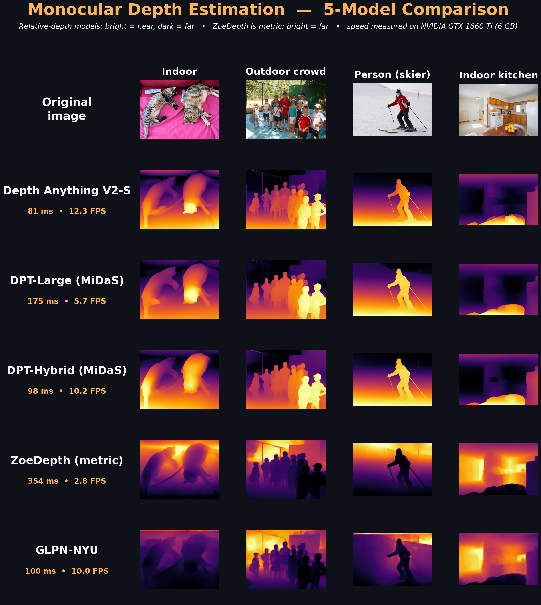

# Monocular Depth Estimation — 5-Model Benchmark

Head-to-head comparison of **5 popular monocular depth-estimation models** on the same
images — comparing both **depth-map quality** and **inference speed (FPS)**, all on a
single consumer GPU (NVIDIA GTX 1660 Ti, 6 GB) using **PyTorch + Hugging Face Transformers**.

> Monocular depth estimation predicts how far every pixel is from the camera using a
> **single** image — no stereo rig, no LiDAR. It powers autonomous driving, robotics,
> AR/VR, and computational photography (e.g. portrait-mode blur).



*Color key: relative-depth models → **bright = near, dark = far**. ZoeDepth is **metric**
(outputs meters), so its colors read inverted (**bright = far**).*

---

## Models compared

| Model | Type | Avg inference | Speed | Notes |
|---|---|---|---|---|
| **Depth Anything V2-Small** | Relative | ~81 ms | **12.3 FPS** ⚡ | Sharpest + fastest — best all-rounder |
| **DPT-Hybrid (MiDaS)** | Relative | ~98 ms | 10.2 FPS | Good speed/quality balance |
| **GLPN-NYU** | Relative | ~100 ms | 10.0 FPS | Great indoors, weak outdoors (indoor-trained) |
| **DPT-Large (MiDaS)** | Relative | ~175 ms | 5.7 FPS | Heavy ViT backbone |
| **ZoeDepth (NYU+KITTI)** | **Metric (m)** | ~354 ms | 2.8 FPS | Only model giving real-world distances |

*Speeds measured on an NVIDIA GTX 1660 Ti (6 GB). See [`output/timings.csv`](output/timings.csv).*

### Key takeaways
1. **State-of-the-art ≠ slow.** Depth Anything V2 runs in real time (~12 FPS) on a 6 GB consumer GPU.
2. **Match the model to the task.** Use relative depth for visual effects; use **metric** depth (ZoeDepth) when you need actual distances in meters.
3. **Training data defines limits.** GLPN-NYU is excellent indoors but breaks down outdoors.

---

## Setup

Requires Python 3.9+ and (optionally) a CUDA GPU.

```bash
# 1. Install PyTorch (CUDA 12.1 build shown; use the right one for your machine)
pip install torch torchvision --index-url https://download.pytorch.org/whl/cu121

# 2. Install the rest
pip install -r requirements.txt
```

CPU-only works too — just install the CPU build of PyTorch (inference will be slower).

## Usage

```bash
# 1. Download the sample test images (indoor / outdoor / person / kitchen)
python download_samples.py

# 2. Run all 5 models, save depth maps, time them
python compare.py

# 3. Stitch results into a single shareable comparison image
python stitch.py
```

To use **your own images**, just drop them into the `input/` folder and run
`compare.py` then `stitch.py` (skip step 1).

## Outputs

| File | Description |
|---|---|
| `output/comparison_grid.png` | Side-by-side grid (images × models) |
| `output/stitched_comparison.png` | Presentable stitched figure with speeds |
| `output/<model>/<image>.png` | Per-model colorized depth maps |
| `output/timings.csv` | Load + per-image inference times |

## Project structure

```
.
├── download_samples.py   # fetch sample test images
├── compare.py            # run all 5 models, save maps + timings
├── stitch.py             # build the final comparison figure
├── requirements.txt
├── input/                # input images
└── output/               # depth maps, grid, timings
```

---

## Models & credits

- [Depth Anything V2](https://huggingface.co/depth-anything/Depth-Anything-V2-Small-hf)
- [DPT / MiDaS (Intel)](https://huggingface.co/Intel/dpt-large)
- [ZoeDepth (Intel)](https://huggingface.co/Intel/zoedepth-nyu-kitti)
- [GLPN (vinvino02)](https://huggingface.co/vinvino02/glpn-nyu)

Built with [PyTorch](https://pytorch.org/) and [Hugging Face Transformers](https://huggingface.co/docs/transformers).
Sample images from the [COCO](https://cocodataset.org/) dataset.

## License

MIT
