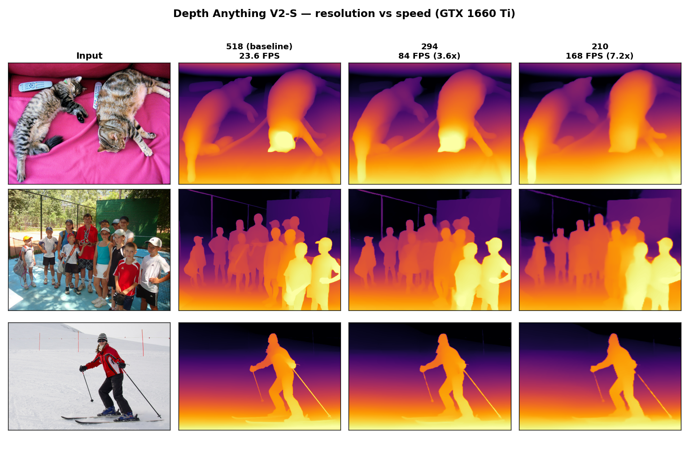
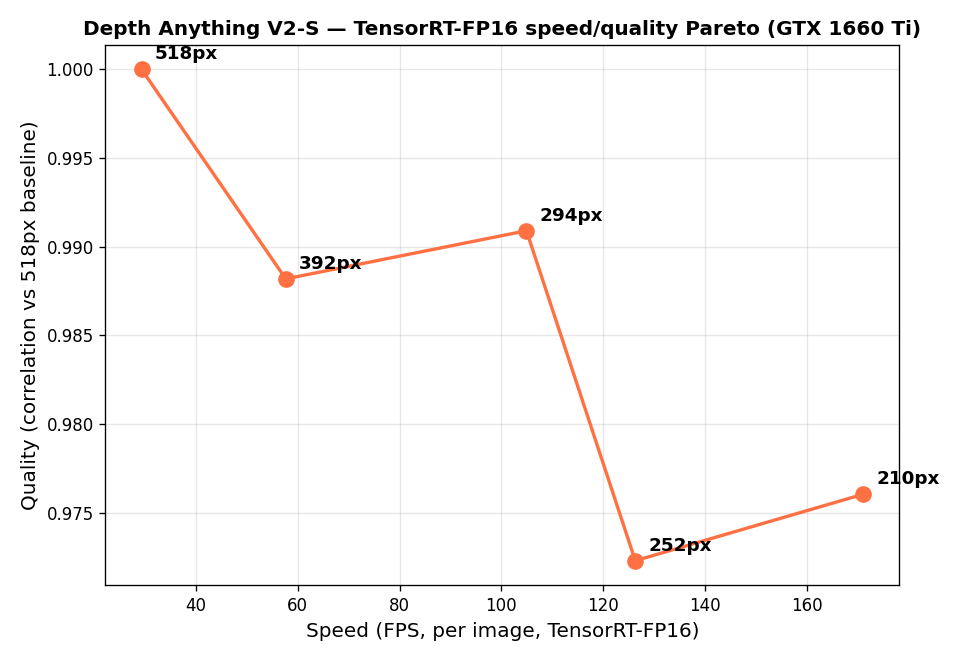

# Monocular Depth Estimation — 5-Model Benchmark

Head-to-head comparison of **5 popular monocular depth-estimation models** on the same
images — comparing both **depth-map quality** and **inference speed (FPS)**, all on a
single consumer GPU (NVIDIA GTX 1660 Ti, 6 GB) using **PyTorch + Hugging Face Transformers**.

> Monocular depth estimation predicts how far every pixel is from the camera using a
> **single** image — no stereo rig, no LiDAR. It powers autonomous driving, robotics,
> AR/VR, and computational photography (e.g. portrait-mode blur).


*Color key: relative-depth models → **bright = near, dark = far**. ZoeDepth is **metric**
(outputs meters), so its colors read inverted (**bright = far**).*

---

## Models compared

| Model | Type | Avg inference | Speed | Notes |
|---|---|---|---|---|
| **Depth Anything V2-Small** | Relative | ~81 ms | **12.3 FPS** ⚡ | Sharpest + fastest — best all-rounder |
| **DPT-Hybrid (MiDaS)** | Relative | ~98 ms | 10.2 FPS | Good speed/quality balance |
| **GLPN-NYU** | Relative | ~100 ms | 10.0 FPS | Great indoors, weak outdoors (indoor-trained) |
| **DPT-Large (MiDaS)** | Relative | ~175 ms | 5.7 FPS | Heavy ViT backbone |
| **ZoeDepth (NYU+KITTI)** | **Metric (m)** | ~354 ms | 2.8 FPS | Only model giving real-world distances |

*Speeds measured on an NVIDIA GTX 1660 Ti (6 GB). See [`output/timings.csv`](output/timings.csv).*

### Key takeaways
1. **State-of-the-art ≠ slow.** Depth Anything V2 runs in real time (~12 FPS) on a 6 GB consumer GPU.
2. **Match the model to the task.** Use relative depth for visual effects; use **metric** depth (ZoeDepth) when you need actual distances in meters.
3. **Training data defines limits.** GLPN-NYU is excellent indoors but breaks down outdoors.

---

## ⚡ Optimizing the winner — 4.6× faster inference

After the benchmark, we took the best model (**Depth Anything V2-Small**) and pushed its
inference speed on the same GTX 1660 Ti. Every optimization was measured for **both speed
and quality** (correlation vs. the original output) so nothing trades accuracy blindly.

**Result: 22.9 → 104.9 FPS (4.6×) with visually identical depth**, by stacking two levers:
input resolution and a TensorRT FP16 engine.

| Stage | FPS | Speedup | Quality |
|---|---|---|---|
| PyTorch fp32 @ 518 (original) | 22.9 | 1.0× | — |
| + input resolution 294px | 63.8 | 2.8× | corr 0.99 |
| **+ TensorRT-FP16 @ 294px** ⭐ | **104.9** | **4.6×** | corr 0.99 |
| push to 210px (max speed) | 171.1 | 7.5× | corr 0.98 |



### What worked, what didn't (on this Turing GPU)
| Technique | Outcome |
|---|---|
| **Input resolution** (518→294) | ✅ 2.8× free, visually identical — the biggest single lever |
| **TensorRT FP16 engine** | ✅ +1.6× on top, numerically stable (corr 1.000 vs PyTorch) |
| ONNX Runtime CUDA EP | ⚠️ no gain (≈ PyTorch eager) |
| Eager PyTorch FP16 | ❌ 4× *slower* + NaNs (no tensor cores / FP16 conv kernels on GTX 16-series) |
| `torch.compile` | ❌ needs Triton (no Windows support) |
| INT8 (ORT QDQ → TensorRT) | ❌ TensorRT can't consume ORT's QDQ graph for this ViT; needs native TRT calibrator |

The TensorRT-FP16 speed/quality Pareto across resolutions (**294px is the sweet spot** — it
dominates 392px on both axes):



### Reproduce the optimization
```bash
python benchmark.py         # PyTorch variants: fp32/fp16/channels_last + resolution sweep
python optimize_visual.py   # visual quality vs resolution -> output/optimization_quality.png

# TensorRT path (optional — needs onnxruntime-gpu + tensorrt, see requirements.txt)
python export_onnx.py       # export fixed-size ONNX models
python bench_onnx.py         # PyTorch vs ONNX-CUDA vs TensorRT-FP16
python bench_trt_sweep.py    # TensorRT-FP16 resolution Pareto -> output/trt_pareto.png
```

> Practical config: run the HF pipeline at a lower `size` (e.g. 294) for ~2.8× free, and add
> a TensorRT-FP16 engine for the full 4.6×. FP16 helps **only** through TensorRT here — eager
> PyTorch FP16 is slower on the tensor-core-less GTX 16-series.

---

## Setup

Requires Python 3.9+ and (optionally) a CUDA GPU.

```bash
# 1. Install PyTorch (CUDA 12.1 build shown; use the right one for your machine)
pip install torch torchvision --index-url https://download.pytorch.org/whl/cu121

# 2. Install the rest
pip install -r requirements.txt
```

CPU-only works too — just install the CPU build of PyTorch (inference will be slower).

## Usage

```bash
# 1. Download the sample test images (indoor / outdoor / person / kitchen)
python download_samples.py

# 2. Run all 5 models, save depth maps, time them
python compare.py

# 3. Stitch results into a single shareable comparison image
python stitch.py
```

To use **your own images**, just drop them into the `input/` folder and run
`compare.py` then `stitch.py` (skip step 1).

### Optional: download models for offline use

By default the models are pulled from the Hugging Face Hub on first run. To save
local copies (e.g. for offline use), run:

```bash
python download_models.py   # saves each model into models/<name>/
```

Then point the pipeline at the local folder:

```python
pipeline("depth-estimation", model="models/depth_anything_v2_small", device=0)
```

**Download sizes** (`models/` is gitignored — weights are not committed):

| Model | Folder | Size |
|---|---|---|
| Depth Anything V2-Small | `models/depth_anything_v2_small` | ~95 MB |
| DPT-Hybrid (MiDaS) | `models/dpt_hybrid` | ~468 MB |
| GLPN-NYU | `models/glpn_nyu` | ~468 MB |
| ZoeDepth | `models/zoedepth` | ~1.3 GB |
| DPT-Large (MiDaS) | `models/dpt_large` | ~2.6 GB |
| **Total** | | **~4.9 GB** |

## Outputs

| File | Description |
|---|---|
| `output/comparison_grid.png` | Side-by-side grid (images × models) |
| `output/stitched_comparison.png` | Presentable stitched figure with speeds |
| `output/<model>/<image>.png` | Per-model colorized depth maps |
| `output/timings.csv` | Load + per-image inference times |
| `output/optimization_quality.png` | Depth quality vs input resolution |
| `output/trt_pareto.png` | TensorRT-FP16 speed/quality Pareto |

## Project structure

```
.
├── download_samples.py   # fetch sample test images
├── download_models.py    # save all 5 models locally (offline use)
├── compare.py            # run all 5 models, save maps + timings
├── stitch.py             # build the final comparison figure
│
│   # optimization (Depth Anything V2-S)
├── benchmark.py          # PyTorch variants: fp16/channels_last/resolution/compile
├── optimize_visual.py    # visual quality vs resolution
├── export_onnx.py        # export ONNX (dynamic + fixed-size)
├── bench_onnx.py         # PyTorch vs ONNX-CUDA vs TensorRT-FP16
├── bench_trt_sweep.py    # TensorRT-FP16 resolution Pareto
├── optimize_int8.py      # INT8 quantization attempt (documented dead-end)
│
├── requirements.txt
├── input/                # input images
├── output/               # depth maps, grids, plots, timings
├── models/               # local model weights   (gitignored, ~4.9 GB)
└── onnx/                 # ONNX models + TRT engines (gitignored, ~1 GB)
```

---

## Models & credits

- [Depth Anything V2](https://huggingface.co/depth-anything/Depth-Anything-V2-Small-hf)
- [DPT / MiDaS (Intel)](https://huggingface.co/Intel/dpt-large)
- [ZoeDepth (Intel)](https://huggingface.co/Intel/zoedepth-nyu-kitti)
- [GLPN (vinvino02)](https://huggingface.co/vinvino02/glpn-nyu)

Built with [PyTorch](https://pytorch.org/) and [Hugging Face Transformers](https://huggingface.co/docs/transformers).
Sample images from the [COCO](https://cocodataset.org/) dataset.

## License

MIT
